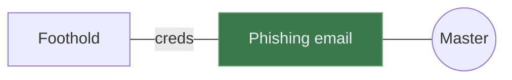

# Attack Path Mapper

A self-contained, single-file HTML5 tool for visualising and editing attack path
maps. Opens directly in any modern browser — no install, no server, no internet
access needed at runtime. Saves and loads in **Mermaid** format, wrapped in a
Markdown code block so committed files render as a diagram on GitHub.

```
open apm-mermaid.html
```

## What you get

- Generic directed graph editor: a **master** node (red circle) plus arbitrary
  child nodes (rounded boxes) connected by lines.
- Per-node fill colour (8-swatch palette).
- Per-node hover notes — folded-corner glyph signals which nodes have one;
  hover the node to read it.
- Per-edge labels, solid/dotted styles, and parametric Bezier bends.
- BFS-based auto-layout that's aware of node widths and edge label widths so
  long labels never collide with wide nodes.
- Auto layout (**A** key): un-pins every manual drag, re-runs the layout, and
  animates nodes to their new slots.
- Save → `.md` with a fenced ` ```mermaid ` block. GitHub renders it as a
  diagram; the tool reloads it with full fidelity.

## Keyboard shortcuts

| Key             | Action                                          |
| --------------- | ----------------------------------------------- |
| **N**           | New free-floating node                          |
| **Tab**         | Chain a new node off the selected one (Shift+Tab reverses the edge) |
| **Enter**       | Sibling — new node sharing parents              |
| **C**           | Connect — then click a target node to draw an edge |
| **E**           | Add / edit the note on the selected node        |
| **← ↑ → ↓**     | Move the selection to the nearest node          |
| **R**           | Rename selected node                            |
| **Del** / **Backspace** | Delete selected (with cascade)          |
| **D**           | Flip layout direction (LR ↔ RL)                 |
| **A**           | Auto layout — un-pin everything, reflow, and fit |
| **F**           | Fit the whole graph to the viewport             |
| **Esc**         | Cancel any inline editor or gesture             |

### Mouse gestures

- **Drag a line** — bend it (smooth quadratic Bezier; the click point follows
  the cursor).
- **Double-click a line** — toggle solid / dotted.
- **Right-click a node** — colour swatches + **Note** action.
- **Right-click a line** — open the edge label editor.
- **Drag a node** — "pin" it; the auto-layout will leave that node alone
  thereafter (until auto layout — the **A** key — un-pins everything).

## File format

Saved files are Markdown with a fenced Mermaid block:

````markdown
# Attack Path Map


````

What's standard Mermaid vs. APM-specific:

- **Mermaid-native**: node shapes (`((label))` circle = master; `["label"]` box),
  edges (`---` solid, `-.-` dotted, `|"label"|` annotation), `style` directives
  for fill colours. Anything in the body renders identically in any Mermaid
  viewer (GitHub, mermaid.live, etc.).
- **APM-DATA comment**: a single `%% APM-DATA: { ... JSON ... }` line carries
  the bits Mermaid can't represent — absolute node positions, parametric edge
  bends, hover notes. Mermaid (and GitHub's renderer) ignore `%%` lines, so
  the diagram renders correctly elsewhere; opening the file back in this tool
  restores full fidelity.

The loader also accepts plain Mermaid (no Markdown wrapper) — useful for
pasting from `mermaid.live` or hand-written diagrams.

## Toolbar

| Button       | What it does                                                |
| ------------ | ----------------------------------------------------------- |
| **New**      | Clear the canvas                                            |
| **Open**     | Load a Mermaid `.md` / `.mmd` / `.mermaid` file             |
| **Save**     | Download the graph as `.md` with the Mermaid block          |

Fit and auto-layout are keyboard-only: **F** fits the graph to the
viewport, **A** runs auto layout (un-pin everything, reflow, fit).

## Notes on the implementation

- Rendering engine: [vis-network](https://github.com/visjs/vis-network) (v9.x,
  minified copy inlined in the HTML — no external requests at runtime).
- Custom drawing layers (in `beforeDrawing` / `afterDrawing` canvas hooks):
  dot grid backdrop, master aura, bent edges, node gradient/highlight pass,
  edge labels, folded-corner note indicators.
- No build step. Edit the HTML in place; refresh the browser.

## File layout

```
apm-mermaid.html   # the whole tool
README.md          # this file
.gitignore
```

That's it — one file. Move it anywhere.
