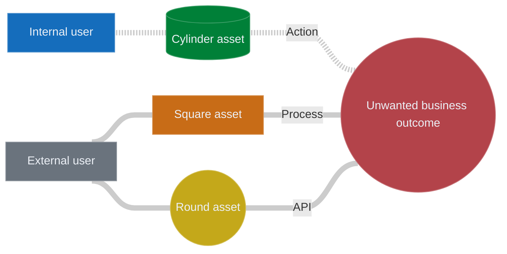

# Attack Path Map Editor

A self-contained, single-file HTML5 tool for visualising and editing attack path
maps. Opens directly in any modern browser — no install, no server, no internet
access needed at runtime. Saves and loads in **Mermaid** format, wrapped in a
Markdown code block so committed files render as a diagram on GitHub.

## Run it

- **Hosted:** open <https://tomituominen.github.io/APME/> — nothing to install;
  it runs entirely in your browser, and because it's served over HTTPS the
  native Save/Open dialogs work in Chromium.
- **Locally:** clone or download the repo and open `index.html` (e.g. `open
  index.html`). For the native Save/Open dialogs, serve the folder instead
  (see the tip below).

> **Tip:** double-clicking the file (a `file://` page) works fully, but the
> native Save/Open *dialogs* (pick name + location, overwrite-in-place) need a
> secure context — serve the folder over `localhost`/HTTPS in a Chromium
> browser (e.g. `python3 -m http.server`). On `file://`, Firefox, or Safari,
> Save falls back to a filename prompt + download.

## Example

The repo ships [`sample-graph.md`](sample-graph.md) — open it in the editor.
Because the file is a fenced Mermaid block, GitHub renders it as a diagram;
here is `sample-graph.md`:



## Keyboard shortcuts

| Key             | Action                                          |
| --------------- | ----------------------------------------------- |
| **N**           | New free-floating node                          |
| **Tab**         | Chain a new node off the selected one (Shift+Tab reverses the edge) |
| **Enter**       | Sibling — new node sharing parents              |
| **C**           | Connect — then click a target node to draw an edge |
| **E**           | Add / edit the note on the selected node        |
| **← ↑ → ↓**     | Move the selection to the nearest node          |
| **R**           | Rename selected node                            |
| **Del** / **Backspace** | Delete selected (with cascade)          |
| **D**           | Flip layout direction (LR ↔ RL)                 |
| **A**           | Auto layout — un-pin everything, reflow, and fit |
| **F**           | Fit the whole graph to the viewport             |
| **⌘/Ctrl+S**    | Save (hold **Shift** for Save As)               |
| **Esc**         | Cancel any inline editor or gesture             |

### Mouse gestures

- **Drag a line** — bend it (smooth quadratic Bezier; the click point follows
  the cursor).
- **Double-click a line** — toggle solid / dotted. New lines start **dotted**
  (the dotted "attack path" line is the common case); double-click to make one
  solid. Opened files keep whatever style they were saved with.
- **Right-click a node** — colour swatches, a shape toggle (box / database
  cylinder / circle), and the **Note** action. (The master's shape is fixed,
  so its picker omits the shape row.)
- **Right-click a line** — open the edge label editor.
- **Drag a node** — "pin" it; the auto-layout will leave that node alone
  thereafter (until auto layout — the **A** key — un-pins everything).

## File format

Saved files are Markdown with a fenced Mermaid block:

````markdown
# Attack Path Map


````

What's standard Mermaid vs. APM-specific:

- **Mermaid-native**: node shapes — `["label"]` box, `[("label")]` database
  cylinder, `(("label"))` circle (the master is always a circle, recorded by
  id in `APM-DATA.master` so a regular circle isn't mistaken for it),
  edges (`---` solid, `-.-` dotted, `|"label"|` annotation), `style` directives
  for fill colours, a `linkStyle default` for line colour + width, and an
  `%%{init: {flowchart: {curve}}}%%` directive for the line-curve style (chosen
  in the toolbar). Anything in the body renders identically in any Mermaid
  viewer (GitHub, mermaid.live, etc.); on re-import the loader reads the curve
  back into the dropdown and ignores `linkStyle`.
- **APM-DATA comment**: a single `%% APM-DATA: { ... JSON ... }` line carries
  the bits Mermaid can't represent — absolute node positions, parametric edge
  bends, hover notes. Mermaid (and GitHub's renderer) ignore `%%` lines, so
  the diagram renders correctly elsewhere; opening the file back in this tool
  restores full fidelity.

### Notes on GitHub

A node's hover note is also surfaced for readers who don't have the tool:

- The noted node gets a footnote marker appended to its label (`Web server ①`).
- A `click` directive links the node to its note anchor — this jumps to the
  note in loose-security viewers (mermaid.live, VS Code, self-hosted docs).
  GitHub sandboxes the diagram in an iframe and runs Mermaid in strict mode,
  so the click is inert there — harmless, just not interactive.
- A `## Notes` section below the diagram lists every note as plain Markdown,
  keyed by the same marker. **This is always visible on GitHub**, so the note
  text is never lost to readers.

On re-import the tool reads notes from the authoritative `APM-DATA` block,
strips the markers off the labels, and ignores the `click` lines and the
`## Notes` section — so the round-trip stays lossless.

The loader also accepts plain Mermaid (no Markdown wrapper) — useful for
pasting from `mermaid.live` or hand-written diagrams.

## Toolbar

| Control      | What it does                                                |
| ------------ | ----------------------------------------------------------- |
| **New**      | Clear the canvas                                            |
| **Open**     | Open a Mermaid `.md` / `.mmd` / `.mermaid` file             |
| **Save**     | Save the graph (also **⌘/Ctrl+S**); **Shift** = Save As     |
| **Curve ▾**  | Line-curve style written into the saved Mermaid (`bumpX` default). Only affects how the saved file renders elsewhere (GitHub/mermaid.live), not the editor. Opening a file adopts its curve. |

Save and Open use the browser's native file dialogs via the **File System
Access API** where available (Chromium served over `localhost`/HTTPS): you
pick the name and location, and a later **Save** overwrites the same file in
place. Where that API isn't available — Firefox, Safari, or the page opened
straight off `file://` — Open falls back to the OS file picker and Save
prompts for a filename, then downloads the `.md` (the name is remembered for
next time).

Fit and auto-layout are keyboard-only: **F** fits the graph to the
viewport, **A** runs auto layout (un-pin everything, reflow, fit).

## Auto-save & crash recovery

The working graph is continuously mirrored to the browser's `localStorage`, so
a crash, an accidental tab close, or a power loss can't destroy unsaved work —
there's nothing to switch on.

- The draft is written ~0.8 s after any change (and flushed immediately when
  the tab is hidden or closed), so at most about a second of work is ever at
  risk. The payload is the exact same Mermaid text **Save** writes, so a
  recovered draft is loss-free (positions, bends, notes, colours, curve, and
  direction all survive).
- A draft is kept **only while there are unsaved changes**. The moment the
  graph matches the last Save/Open/New, the draft is dropped — so a stale draft
  never shadows a file you've already saved.
- On the next launch, if a draft survived, a small banner offers **Restore** or
  **Discard**. It's non-blocking — the canvas is usable behind it. Restored
  work stays marked unsaved so you're nudged to **Save** it to a real file.
- This is a safety net, not a substitute for saving: it lives in one browser
  profile on one machine, holds a single most-recent draft, and is cleared by
  **Discard** or by the browser clearing site data. If `localStorage` is
  unavailable (e.g. locked-down private mode), auto-save silently does nothing.

## Notes on the implementation

- Rendering engine: [vis-network](https://github.com/visjs/vis-network) (v9.x,
  minified copy inlined in the HTML — no external requests at runtime).
- Custom drawing layers (in `beforeDrawing` / `afterDrawing` canvas hooks):
  dot grid backdrop, master aura, selection/hover edge glow, bent edges, node
  gradient/highlight pass, database cylinders, soft note glow on noted nodes,
  and edge labels.
- No build step. Edit the HTML in place; refresh the browser.

## License

Released under the [Don't Be A Dick Public License](LICENSE.md) (DBAD, v1.1):
do whatever you like with it — just don't be a dick. See [`LICENSE.md`](LICENSE.md)
for the full text.
