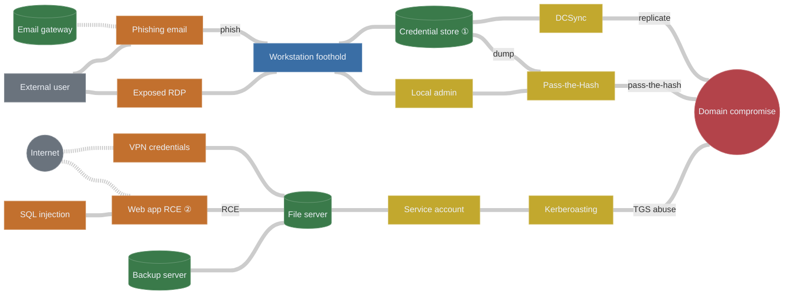

# Attack Path Map

```mermaid
%%{init: {"flowchart": {"curve": "bumpX"}}}%%
%% APM-DATA: {"v":1,"dir":"RL","master":"n1","pos":{"n1":[1,-68],"n2":[-481,-268],"n3":[-481,-68],"n4":[-481,132],"n5":[-881,-176],"n6":[-881,24],"n7":[-881,224],"n8":[-1261,124],"n9":[-1261,-176],"n10":[-1691,216],"n11":[-1691,416],"n12":[-1691,-384],"n13":[-1691,-184],"n14":[-2071,-84],"n15":[-2071,216],"n16":[-2071,416],"n17":[-2071,-284],"n18":[-1691,16]},"bends":{},"notes":{"n6":"Cached domain credentials harvested with Mimikatz.","n13":"Unauthenticated RCE in the public-facing web app."}}
flowchart RL
  n1(("Domain compromise"))
  n2["DCSync"]
  n3["Kerberoasting"]
  n4["Pass-the-Hash"]
  n5["Service account"]
  n6[("Credential store ①")]
  n7["Local admin"]
  n8["Workstation foothold"]
  n9[("File server")]
  n10["Phishing email"]
  n11["Exposed RDP"]
  n12["VPN credentials"]
  n13["Web app RCE ②"]
  n14["SQL injection"]
  n15[("Email gateway")]
  n16["External user"]
  n17(("Internet"))
  n18[("Backup server")]
  n1 ---|"replicate"| n2
  n1 ---|"TGS abuse"| n3
  n1 ---|"pass-the-hash"| n4
  n3 --- n5
  n2 --- n6
  n4 ---|"dump"| n6
  n4 --- n7
  n6 --- n8
  n7 --- n8
  n5 --- n9
  n8 ---|"phish"| n10
  n8 --- n11
  n9 --- n12
  n9 ---|"RCE"| n13
  n13 --- n14
  n10 -.- n15
  n10 --- n16
  n11 --- n16
  n12 -.- n17
  n13 -.- n17
  n9 --- n18
  linkStyle default stroke:#cccccc,stroke-width:7.5px;

  style n1 fill:#b3434a,stroke:#c67277,color:#ecf0f6
  style n2 fill:#c2a82e,stroke:#d1be62,color:#ecf0f6
  style n3 fill:#c2a82e,stroke:#d1be62,color:#ecf0f6
  style n4 fill:#c2a82e,stroke:#d1be62,color:#ecf0f6
  style n5 fill:#c2a82e,stroke:#d1be62,color:#ecf0f6
  style n6 fill:#3a7a4a,stroke:#6b9b77,color:#ecf0f6
  style n7 fill:#c2a82e,stroke:#d1be62,color:#ecf0f6
  style n8 fill:#3a6ea5,stroke:#6b92bc,color:#ecf0f6
  style n9 fill:#3a7a4a,stroke:#6b9b77,color:#ecf0f6
  style n10 fill:#c2702e,stroke:#d19462,color:#ecf0f6
  style n11 fill:#c2702e,stroke:#d19462,color:#ecf0f6
  style n12 fill:#c2702e,stroke:#d19462,color:#ecf0f6
  style n13 fill:#c2702e,stroke:#d19462,color:#ecf0f6
  style n14 fill:#c2702e,stroke:#d19462,color:#ecf0f6
  style n15 fill:#3a7a4a,stroke:#6b9b77,color:#ecf0f6
  style n16 fill:#6a737d,stroke:#8f969e,color:#ecf0f6
  style n17 fill:#6a737d,stroke:#8f969e,color:#ecf0f6
  style n18 fill:#3a7a4a,stroke:#6b9b77,color:#ecf0f6

  click n6 "#note-n6" "Credential store"
  click n13 "#note-n13" "Web app RCE"
```

## Notes

**① Credential store**

Cached domain credentials harvested with Mimikatz\.

**② Web app RCE**

Unauthenticated RCE in the public\-facing web app\.
