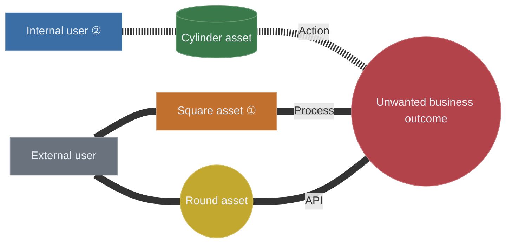

# Attack Path Map

```mermaid
%% APM-DATA: {"v":1,"dir":"RL","master":"n2","pos":{"n2":[0,0],"n4":[-390,-227],"n5":[-390,-27],"n6":[-390,173],"n7":[-770,-235],"n8":[-770,65]},"bends":{"n2|n4":[-0.0741,0.3825],"n2|n5":[-0.0181,0.0348],"n2|n6":[-0.0486,-0.3349]},"notes":{"n5":"Important note about the asset","n7":"Important note about the user"}}
flowchart RL
  n2(("Unwanted business outcome"))
  n4[("Cylinder asset")]
  n5["Square asset ①"]
  n6(("Round asset"))
  n7["Internal user ②"]
  n8["External user"]
  n2 -.-|"Action"| n4
  n2 ---|"Process"| n5
  n2 ---|"API"| n6
  n4 -.- n7
  n5 --- n8
  n6 --- n8
  linkStyle default stroke-width:10px;

  style n2 fill:#b3434a,stroke:#c67277,color:#ecf0f6
  style n4 fill:#3a7a4a,stroke:#6b9b77,color:#ecf0f6
  style n5 fill:#c2702e,stroke:#d19462,color:#ecf0f6
  style n6 fill:#c2a82e,stroke:#d1be62,color:#ecf0f6
  style n7 fill:#3a6ea5,stroke:#6b92bc,color:#ecf0f6
  style n8 fill:#6a737d,stroke:#8f969e,color:#ecf0f6

  click n5 "#note-n5" "Square asset"
  click n7 "#note-n7" "Internal user"
```

## Notes

**① Square asset**

Important note about the asset

**② Internal user**

Important note about the user
