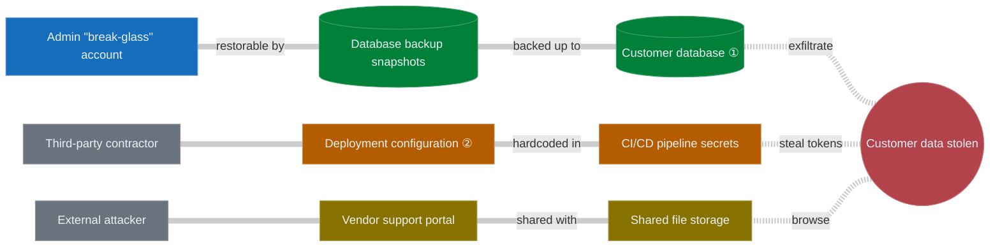

# Attack Path Map

```mermaid
%%{init: {"flowchart": {"curve": "bumpX"}}}%%
%% APM-DATA: {"v":1,"dir":"RL","master":"n1","notes":{"n2":"Holds customer contact details and order history.","n6":"Plain-text API tokens sit next to the deployment manifests."}}
flowchart RL
  n1(("Customer data stolen"))
  n2[("Customer database ①")]
  n3["CI/CD pipeline secrets"]
  n4["Shared file storage"]
  n5[("Database backup snapshots")]
  n6["Deployment configuration ②"]
  n7["Vendor support portal"]
  n8["Admin #quot;break-glass#quot; account"]
  n9["External attacker"]
  n10["Third-party contractor"]

  n1 -.-|"exfiltrate"| n2
  n1 -.-|"steal tokens"| n3
  n1 -.-|"browse"| n4
  n2 ---|"backed up to"| n5
  n3 ---|"hardcoded in"| n6
  n4 ---|"shared with"| n7
  n5 ---|"restorable by"| n8
  n6 --- n10
  n7 --- n9
  linkStyle default stroke:#cccccc,stroke-width:7.5px;

  style n1 fill:#b3434a,stroke:#c67277,color:#ecf0f6
  style n2 fill:#008038,stroke:#40a06a,color:#ecf0f6
  style n3 fill:#b35c00,stroke:#c68540,color:#ecf0f6
  style n4 fill:#877200,stroke:#a59540,color:#ecf0f6
  style n5 fill:#008038,stroke:#40a06a,color:#ecf0f6
  style n6 fill:#b35c00,stroke:#c68540,color:#ecf0f6
  style n7 fill:#877200,stroke:#a59540,color:#ecf0f6
  style n8 fill:#156dbc,stroke:#5092cd,color:#ecf0f6
  style n9 fill:#6a737d,stroke:#8f969e,color:#ecf0f6
  style n10 fill:#6a737d,stroke:#8f969e,color:#ecf0f6

  click n2 "#note-n2" "Customer database"
  click n6 "#note-n6" "Deployment configuration"
```

## Notes

**① Customer database**

Holds customer contact details and order history.

**② Deployment configuration**

Plain-text API tokens sit next to the deployment manifests.
